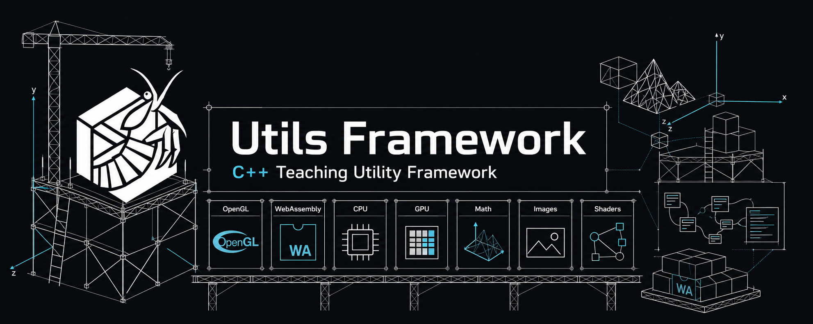

# Utils Framework



`Utils` is the small support framework used by the computer graphics exercises.
It wraps the repetitive parts of OpenGL setup, simple drawing, images, math,
shader handling, render targets, text rendering, and a few convenience tasks so
the exercise code can focus on the graphics concept being taught.

For exact function signatures, open the corresponding header file.

## Quick Start

Most exercises include utilities like this:

```cpp
#include <GLApp.h>
#include <Vec3.h>
#include <Mat4.h>
#include <Image.h>
```

The exercise makefiles compile the utility library in `../Utils` and link
against it:

- native builds use `../Utils/libutils.a`
- Emscripten builds use `../Utils/libutils_emscripten.a`

When writing a new exercise, include `../Utils` in the include path and link the
matching utility library.

## Minimal GLApp

Most interactive exercises derive a small app class from `GLApp`:

```cpp
#include <GLApp.h>

class MyApp : public GLApp {
public:
  MyApp() : GLApp{800, 600, 1, "My Exercise"} {}

  void init() override {
    setBackground(0.05f, 0.06f, 0.08f, 1.0f);
  }

  void draw() override {
    drawRect(Vec4{1.0f, 0.2f, 0.1f, 1.0f},
             Vec2{-0.5f, -0.5f},
             Vec2{ 0.5f,  0.5f});
  }
} myApp;

int main(int argc, char** argv) {
  myApp.run();
  return 0;
}
```

`GLApp` creates the window, OpenGL context, event callbacks, and main loop. Your
exercise usually overrides only the methods it needs.

## GLApp Lifecycle

Common virtual methods:

| Method | Called when | Typical use |
| --- | --- | --- |
| `init()` | once after OpenGL is ready | load data, create shaders, initialize scene |
| `draw()` | every frame | render the current frame |
| `animate(double)` | when animation is enabled | update animated state |
| `resize(winDim, fbDim)` | window or framebuffer size changes | update interaction state |
| `keyboard(...)` | key press/release | toggles and controls |
| `keyboardChar(...)` | typed character | text-like shortcuts such as `r` |
| `mouseButton(...)` | mouse button state changes | start/end dragging |
| `mouseMove(...)` | mouse cursor moves | interaction and arcball rotation |
| `mouseWheel(...)` | wheel/trackpad scroll | zoom or parameter changes |

Useful protected helpers:

| Method | Purpose |
| --- | --- |
| `setBackground(...)` | set clear color |
| `setDrawProjection(Mat4)` | set projection matrix for simple drawing helpers |
| `setDrawTransform(Mat4)` | set model/view transform for simple drawing helpers |
| `drawTriangles(...)` | draw interleaved triangle data |
| `drawLines(...)` | draw line data, optionally with CPU-generated thick lines |
| `drawPoints(...)` | draw point data |
| `drawImage(Image)` | draw a CPU image as a screen-aligned texture |
| `drawRect(...)` | draw a colored rectangle |
| `setLightPos(Vec3)` | set the light used by the built-in lit preview shader |
| `closeWindow()` | close the native application window |

## Simple Drawing Data Layouts

The built-in drawing helpers expect interleaved `std::vector<float>` data.

### Lines and Points

`drawLines` and `drawPoints` use 7 floats per vertex:

```text
x y z   r g b a
```

Example:

```cpp
std::vector<float> lineData = {
  -0.5f, 0.0f, 0.0f,  1.0f, 0.0f, 0.0f, 1.0f,
   0.5f, 0.0f, 0.0f,  0.0f, 0.5f, 1.0f, 1.0f
};

drawLines(lineData, LineDrawType::LIST, 2.0f);
```

### Triangles Without Lighting

Unlit `drawTriangles` uses 7 floats per vertex:

```text
x y z   r g b a
```

Call:

```cpp
drawTriangles(data, TrisDrawType::LIST, false, false);
```

### Triangles With Lighting

Lit `drawTriangles` uses 10 floats per vertex:

```text
x y z   r g b a   nx ny nz
```

Call:

```cpp
setDrawProjection(camera.getViewProjection(getAspect()));
setDrawTransform(scene.getModel());
setLightPos(Vec3{0.0f, 3.0f, 2.0f});
drawTriangles(data, TrisDrawType::LIST, false, true);
```

Many ray tracing exercises use this mode for the interactive OpenGL preview
before the CPU ray-traced result is ready.

## Math Types

The framework provides small vector and matrix types:

| Type | Header | Notes |
| --- | --- | --- |
| `Vec2`, `Vec2i`, `Vec2ui` | `Vec2.h` | 2D float, signed int, unsigned int vectors |
| `Vec3`, `Vec3i`, `Vec3ui` | `Vec3.h` | 3D vectors and colors |
| `Vec4`, `Vec4i`, `Vec4ui` | `Vec4.h` | 4D vectors and RGBA colors |
| `Mat3` | `Mat3.h` | 3x3 matrices |
| `Mat4` | `Mat4.h` | 4x4 transformations |
| `Quaternion` | `Quaternion.h` | rotations, used by `ArcBall` |

Common `Vec3` functions:

```cpp
Vec3 a{1.0f, 0.0f, 0.0f};
Vec3 b{0.0f, 1.0f, 0.0f};

float d = Vec3::dot(a, b);
Vec3 n = Vec3::normalize(a + b);
Vec3 c = Vec3::cross(a, b);
Vec3 r = Vec3::reflect(Vec3{0.0f, -1.0f, 0.0f}, Vec3{0.0f, 1.0f, 0.0f});
```

Common `Mat4` functions:

```cpp
Mat4 model =
  Mat4::translation(Vec3{0.0f, 0.0f, -2.0f}) *
  Mat4::rotationY(30.0f) *
  Mat4::scaling(1.5f);

Vec3 transformedPoint = model * Vec3{1.0f, 0.0f, 0.0f};
```

The exercises consistently use `matrix * vector` and compose transforms with
matrix multiplication.

## Images

`Image` is a CPU-side raster image:

```cpp
Image image{600, 600}; // default 4 components: RGBA
image.setNormalizedValue(10, 20, 0, 1.0f); // red channel
image.setNormalizedValue(10, 20, 1, 0.5f); // green channel
image.setNormalizedValue(10, 20, 2, 0.0f); // blue channel
image.setValue(10, 20, 3, 255);            // alpha channel
```

Important functions:

| Function | Purpose |
| --- | --- |
| `setValue(...)` | write 8-bit channel values |
| `setNormalizedValue(...)` | write values in `[0, 1]` |
| `getValue(...)` | read a channel |
| `sample(x, y, component)` | sample using normalized texture coordinates |
| `filter(Grid2D)` | apply a filter kernel |
| `toGrayscale()` | convert to grayscale |
| `crop(...)`, `resample(...)` | basic image operations |
| `flipVertical()`, `flipHorizontal()` | image orientation fixes |

Use `drawImage(image)` in a `GLApp` to display a CPU-generated image.

## OpenGL Resource Wrappers

The OpenGL wrappers use RAII: they create an OpenGL object in the constructor
and delete it in the destructor.

| Class | Header | Purpose |
| --- | --- | --- |
| `GLProgram` | `GLProgram.h` | compile/link shader programs, set uniforms and textures |
| `GLArray` | `GLArray.h` | vertex array object |
| `GLBuffer` | `GLBuffer.h` | vertex/index buffer |
| `GLTexture1D` | `GLTexture1D.h` | 1D textures |
| `GLTexture2D` | `GLTexture2D.h` | 2D textures and CPU image upload |
| `GLTexture3D` | `GLTexture3D.h` | 3D textures for volume data |
| `GLTextureCube` | `GLTextureCube.h` | cube maps |
| `GLFramebuffer` | `GLFramebuffer.h` | render-to-texture framebuffers |
| `GLDepthBuffer` | `GLDepthBuffer.h` | renderbuffer depth attachment |
| `GLDepthTexture` | `GLDepthTexture.h` | depth texture attachment |

### Shader Example

```cpp
GLProgram program = GLProgram::createFromFile(
  "Shader/vertexShader.vert",
  "Shader/fragmentShader.frag"
);

program.enable();
program.setUniform("MVP", projection * modelView);
program.setUniform("lightPos", Vec3{0.0f, 2.0f, 1.0f});
```

### Texture Example

```cpp
Image image = Image::genTestImage(256, 256);
GLTexture2D texture{image, GL_LINEAR, GL_LINEAR};

program.enable();
program.setTexture("colorTexture", texture, 0);
```

### Framebuffer Example

```cpp
GLTexture2D color;
color.setEmpty(width, height, 4, GLDataType::BYTE);

GLDepthBuffer depth{width, height};
GLFramebuffer framebuffer;

framebuffer.bind(color, depth);
// draw scene into color
framebuffer.unbind2D();
```

Deferred shading and shadow-map exercises use this pattern.

## Geometry Helpers

`Tessellation` stores triangle meshes as separate arrays:

- `vertices`: 3 floats per vertex
- `normals`: 3 floats per vertex
- `tangents`: 3 floats per vertex
- `texCoords`: 2 floats per vertex
- `indices`: triangle indices

Factory functions:

```cpp
Tessellation sphere = Tessellation::genSphere(Vec3{0, 0, 0}, 1.0f, 64, 32);
Tessellation quad = Tessellation::genRectangle(Vec3{0, 0, 0}, 2.0f, 2.0f);
Tessellation brick = Tessellation::genBrick(Vec3{0, 0, 0}, Vec3{1, 2, 3});
Tessellation torus = Tessellation::genTorus(Vec3{0, 0, 0}, 1.0f, 0.25f);
```

`unpack()` expands indexed geometry into linear triangle-list geometry. This is
often useful when feeding data to the simple drawing helpers or when building
exercise-specific triangle lists.

`OBJFile` loads simple OBJ meshes:

```cpp
OBJFile obj{"Datasets/bunny.obj", true}; // normalize=true
```

The loader exposes `vertices`, `normals`, and `indices`; individual exercises
usually convert those into their own scene or acceleration structure formats.

## Interaction Helpers

### ArcBall

`ArcBall` converts mouse drag motion into a rotation quaternion. Several
ray-tracing exercises use it to rotate the preview scene.

```cpp
ArcBall arcBall{Vec2ui{600, 600}};

void mouseButton(int button, int state, int mods, double x, double y) override {
  if (button == GLENV_MOUSE_BUTTON_LEFT && state == GLENV_MOUSE_PRESS)
    arcBall.click(Vec2ui{uint32_t(x), uint32_t(y)});
}

void mouseMove(double x, double y) override {
  Quaternion q = arcBall.drag(Vec2ui{uint32_t(x), uint32_t(y)});
  Mat4 rotation = q.computeRotation();
}
```

### FontRenderer and FontEngine

Use `FontRenderer` to create a `FontEngine`, then render text in normalized
screen coordinates.

```cpp
FontRenderer fontRenderer{"helvetica_neue.bmp", "helvetica_neue.pos"};
std::shared_ptr<FontEngine> fontEngine;

void init() override {
  fontEngine = fontRenderer.generateFontEngine();
}

void draw() override {
  fontEngine->render("OpenGL Preview",
                     getAspect(),
                     0.035f,
                     Vec2{0.0f, -0.92f},
                     Alignment::Center,
                     Vec4{1.0f, 0.0f, 0.0f, 0.9f});
}
```

## BackgroundTask

`BackgroundTask<Result>` hides the difference between native applications and
Emscripten builds for long-running one-shot work.

- Native builds run the work asynchronously using `std::async`.
- Emscripten builds run the work synchronously, because browser builds normally
  cannot use the same native threading setup.
- New requests invalidate older results.
- `cancel()` discards pending and future stale results.

Typical use:

```cpp
BackgroundTask<Image> renderTask;
Image image{600, 600};

void requestRender() {
  renderTask.request();
}

void startRenderIfNeeded() {
  if (!renderTask.canStart())
    return;

  const Scene sceneToRender = scene;
  const Camera cameraToRender = camera;

  renderTask.start([sceneToRender, cameraToRender]() {
    Image result{600, 600};
    Raytracer renderer{9, 9};
    renderer.setScene(sceneToRender);
    renderer.setCamera(cameraToRender);
    renderer.render(result);
    return result;
  });
}

void collectRenderResult() {
  if (renderTask.takeResult(image)) {
    // image now contains the finished render
  }
}
```

This is used in ray tracing style exercises where native builds should remain
interactive while a CPU render is running, but browser builds may block until
the render is finished.

## Random Numbers

`Rand.h` exposes the global `staticRand` and convenience functions:

```cpp
float u = staticRand.rand01();  // [0, 1]
float s = staticRand.rand11();  // [-1, 1]
Vec3 direction = Vec3::randomUnitVector();
```

For reproducible random sequences, create a local `Random` with an explicit
seed:

```cpp
Random rng{1337};
float value = rng.rand01();
```

## Other Utility Modules

| Module | Purpose |
| --- | --- |
| `ColorConversion.h` | RGB, HSV, HSL style color conversions |
| `Grid2D` | 2D scalar grids and filters |
| `ImageLoader` | load image files |
| `PerformanceTimer` | lightweight timing helper |
| `CommandInterpreter` | script/command support used by `GLApp` |
| `Compression`, `Base64Url` | helper code for compact encoded data |
| `AbstractParticleSystem` | support for particle-system style examples |
| `GLScreenshot` | screenshot helper |

## Native vs Browser Builds

The utility framework tries to hide most platform differences:

- `GLApp` maps events from GLFW on native platforms and browser events in
  Emscripten builds.
- `BackgroundTask` maps asynchronous native work to blocking browser work.
- The OpenGL wrappers use APIs that are compatible with the exercise build
  setup where possible.

## Style Notes

- Prefer `Vec2`, `Vec3`, `Vec4`, and `Mat4` over raw arrays in exercise code.
- Use `Image` for CPU-generated rasters and `GLTexture2D` for GPU textures.
- For simple previews, use `drawTriangles`, `drawLines`, `drawPoints`, and
  `drawImage` before writing custom OpenGL boilerplate.
- For custom shaders, use `GLProgram`, `GLBuffer`, and `GLArray` directly.

## License

Copyright (c) 2026 Computer Graphics and Visualization Group, University of
Duisburg-Essen

Permission is hereby granted, free of charge, to any person obtaining a copy of
this software and associated documentation files (the "Software"), to deal in the
Software without restriction, including without limitation the rights to use,
copy, modify, merge, publish, distribute, sublicense, and/or sell copies of the
Software, and to permit persons to whom the Software is furnished to do so,
subject to the following conditions:

The above copyright notice and this permission notice shall be included in all
copies or substantial portions of the Software.

THE SOFTWARE IS PROVIDED "AS IS", WITHOUT WARRANTY OF ANY KIND, EXPRESS OR
IMPLIED, INCLUDING BUT NOT LIMITED TO THE WARRANTIES OF MERCHANTABILITY, FITNESS
FOR A PARTICULAR PURPOSE AND NONINFRINGEMENT. IN NO EVENT SHALL THE AUTHORS OR
COPYRIGHT HOLDERS BE LIABLE FOR ANY CLAIM, DAMAGES OR OTHER LIABILITY, WHETHER
IN AN ACTION OF CONTRACT, TORT OR OTHERWISE, ARISING FROM, OUT OF OR IN
CONNECTION WITH THE SOFTWARE OR THE USE OR OTHER DEALINGS IN THE SOFTWARE.
